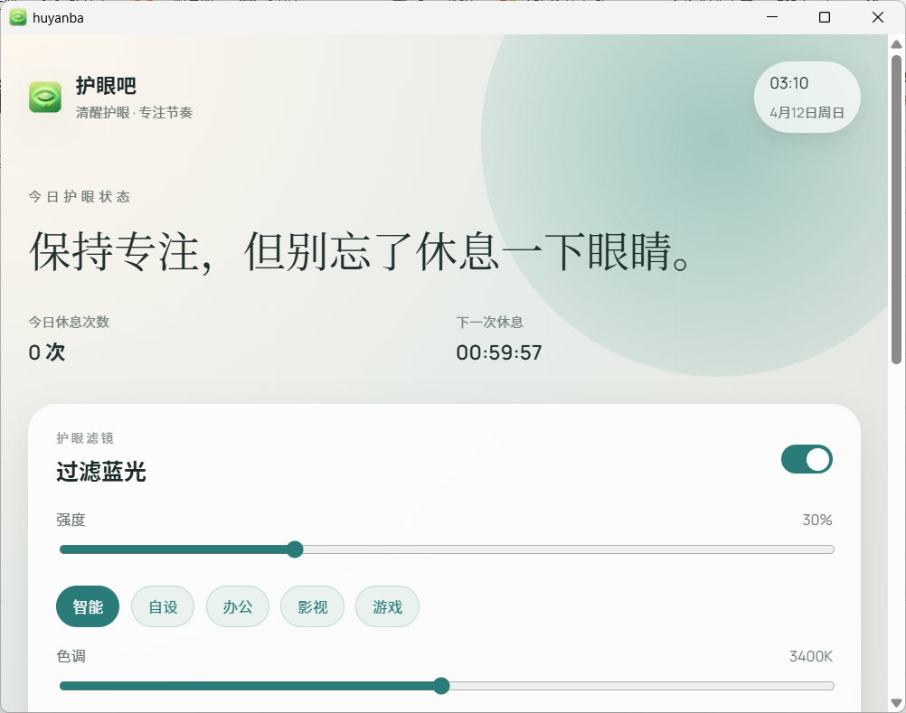
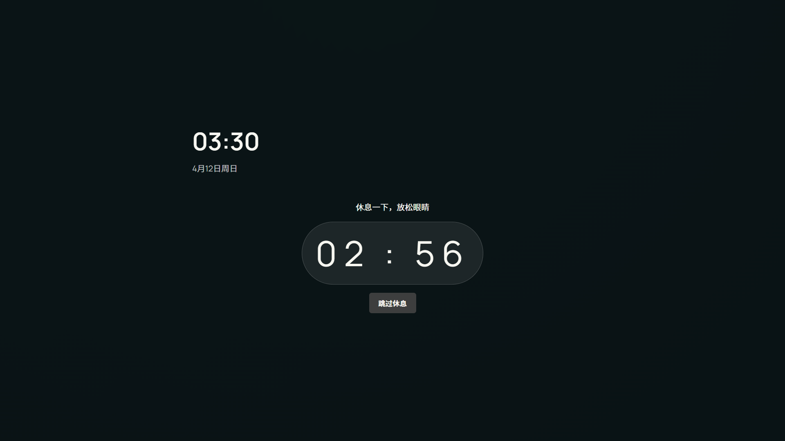
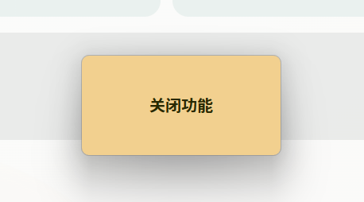
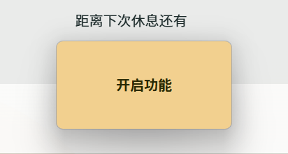

# 护眼吧 (huyanba)

桌面护眼小软件：防蓝光过滤 + 定时休息锁屏。

## 功能概览
- 过滤蓝光：强度 + 色调调节，预设模式（智能/自设/办公/影视/游戏）
- 定时休息：默认每 60 分钟休息 3 分钟
- 全屏休息锁屏：多显示器覆盖、倒计时显示
- 托盘控制：显示/隐藏/立即休息/退出

## 界面截图
- 首页总览（今日休息次数 + 下一次休息）


- 锁屏界面

- 提示框界面（关闭功能 + 开启功能）



## 版本
- 当前打包版本：`3.1.0`

## 安装包位置（本机）
```
huyanba\src-tauri\target\release\bundle\nsis
```

## 下载
https://github.com/huyunan/huyanba/releases/tag/v3.1.0

## 本地开发
```
npm install -g bun
bun run tauri dev
```

## 打包（Windows 安装包）
```
bun run tauri build
```

打包完成后，安装包目录：
```
huyanba\src-tauri\target\release
```

## 说明
- 过滤蓝光通过系统 gamma 曲线实现
- 锁屏使用全屏覆盖窗口（非系统锁屏）

